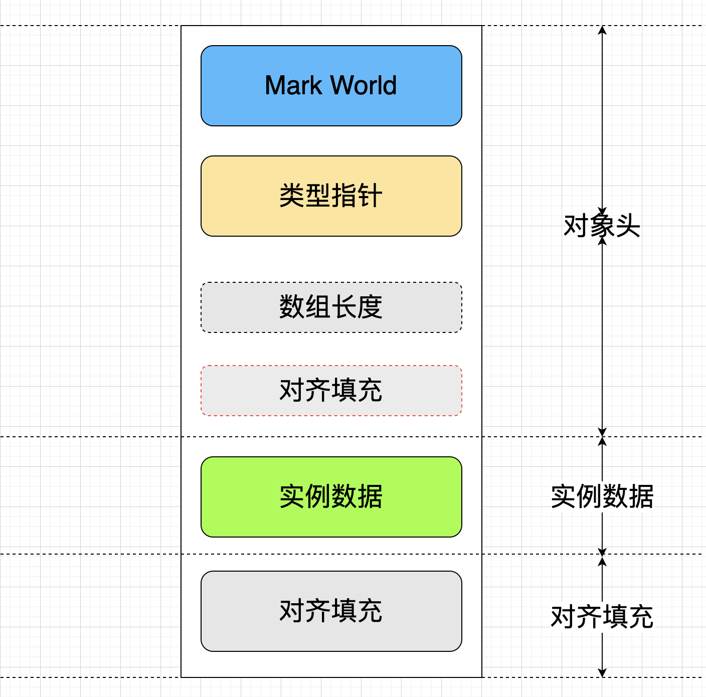
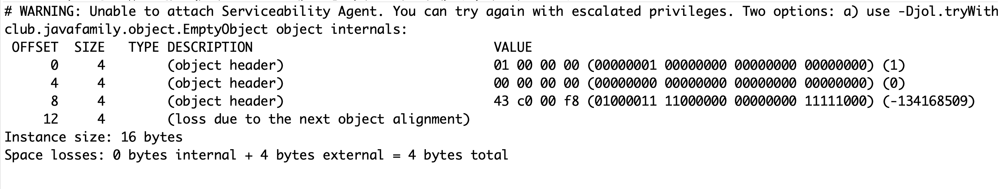
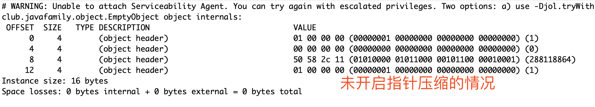
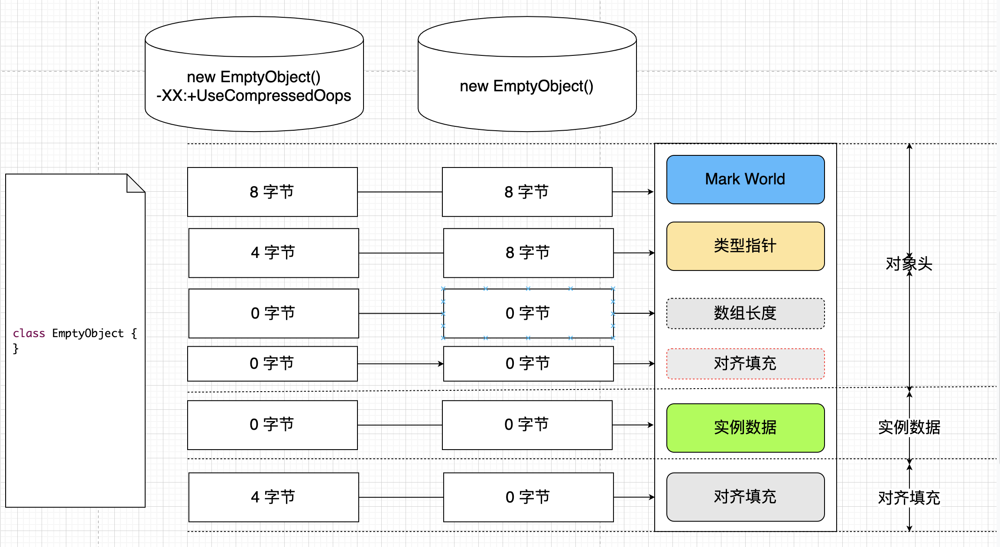
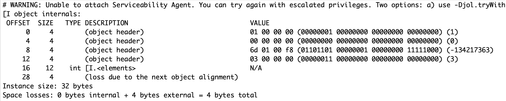
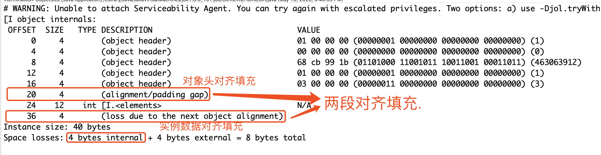
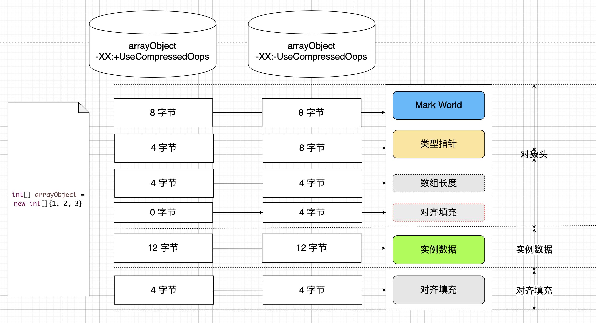
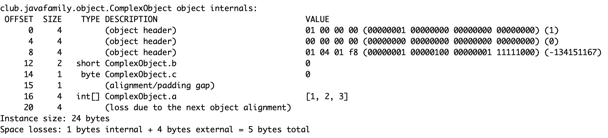

# 2.1.2 Java 对象内存大小 -- <<面向面试官编程>>系列


## 0. 前言


> 面试官: 说一说你平时进行 JVM 调优时如何调整内存大小的?


> 帅帅: 一般情况下, 我们首先需要分析对象大小, 然后根据...


> 面试官: 等等, 如何分析对象大小? 对象大小怎么计算?


> 帅帅: 呃.....


> 面试官: 今天的面试就到这里,  如果公司有意向会给你电话联系. 请保持电话畅通谢谢.


## 1. Java 对象的内存布局


> 在 HotSpot 虚拟机中, 对象在内存中存储的布局可以分为三个部分: 对象头(Header), 实例数据(Instance Data)和对齐填充(Padding). 如下图所示.





### 1.1 对象头

#### 1.1.1 Mark World

> 对象头包括两部分信息, 第一部分用于存储对象自身的运行时数据, 如哈希码, GC 分代年龄, 锁状态标志, 线程持有锁, 偏向线程 ID, 偏向时间戳等, 这部分数据长度在 32 位 和 64 位虚拟机(未开启指针研压缩)中分别为 4 个字节和 8 个字节, 官方称为 `Mark World`.

> 考虑到虚拟机的空间效率, `Mark World` 被设计成一个非固定的数据结构以便在极小的空间内存储尽量多的信息, 它会根据对象的状态复用自己的存储空间.

**Hotspot 虚拟机对象头 Mark Down**

|             **存储内容**              | **标志位** |      **状态**      |
| :-----------------------------------: | :--------: | :----------------: |
|       对象哈希码, 对象分代年龄        |     01     |       未锁定       |
|           指向锁记录的指针            |     00     |     轻量级锁定     |
|          指向重量级锁的指针           |     10     | 膨胀\(重量级锁定\) |
|          空, 不需要记录信息           |     11     |      GC 标记       |
| 偏向线程 ID, 偏向时间戳, 对象分代年龄 |     01     |       可偏向       |


#### 1.1.2 类型指针

> 即对象指向它类元数据的指针, 虚拟机通过这个指针来确定这个对象时哪个类的实例. 并不是所有的虚拟机实现都必须在对象数据上保留类型指针, 也就是说, 查找对象的语言数据信息并不一定经过过对象本身.这会在后边博文详细介绍.


#### 1.1.3 数组长度

> 如果对象是个数组, 那在对象头中还必须有一块用于记录数据长度的数据, 因为虚拟机可以通过普通 Java 对象的元数据信息确定 Java 对象的大小, 但是从数据的元数据中却无法确定数据的大小.


**所以, 如果数组长度只有在对象为 Java 数组类型时才会占内存空间.非数组类型的对象, 如 `String` 对象的数组长度部分大小为 0.**


### 1.2 实例数据

> 实例数据部分就是对象真正存储有效信息, 也是在程序代码中定义的类型的字段,无论是从父类继承还是自己定义的字段都会被记录, 而存储的顺序会和虚拟机的分配策略参数(FieldsAllocationStyle)和字段在 `.java` 源码文件中的定义顺序有关.


#### 1.2.1 虚拟机分配策略

* longs/doubles
* ints
* shorts/chars
* bytes/booleans
* oops(Ordinary Object Pointers)


> 从分配策略可以看出, 相同宽度的字段总是被分配到一起. 在满足这个条件的前提下, 父类中定义的字段会出现在子类之前, 如果 `CompactFields`参数值为 `true`(默认值), 那么子类之中比较窄的非静态（non-static）基本数据类型变量也可能会插入到父类变量的空隙之中, 以提供内存的利用率.


>  `CompactFields`: 假设对象头占用了12个字节，并且再此之后分配的long类型字段不会紧跟在对象头后面分配(long 占 8 个字节, 4 字节不够存)，而是在新一个8字节偏移量位置处开始分配，因此对象头和 long 属性之间存在了4字节的空隙，而这个4字节空隙的大小符合（即，大小足以用于）一个 int 属性的内存分配, 所以，int 属性就被插入到了对象头与 long 属性之间了.


#### 1.2.2 Java 基本类型数据大小


| **类型** | **大小/字节** |
| :------: | :-----------: |
|  double  |       8       |
|   long   |       8       |
|   int    |       4       |
|  float   |       4       |
|  short   |       2       |
|   char   |       2       |
|   byte   |       1       |
| boolean  |      4/1      |


> **误区: boolean 只有 true 和 false 两个状态, 一位就够了, 所以 boolean 占用 1 bit? ** 虽然 Java 虚拟机定义了 boolean 这种数据类型，但是只对它提供了非常有限的支持。在 Java 虚拟机中没有任何供 boolean 值专用的字节码指令，在 Java 语言之中涉及到 boolean 类型值的运算，在编译之后都使用 Java 虚拟机中的 int 数据类型来代替。 Java 虚拟机直接支持 boolean 类型的数组，虚拟机的 newarray 指令可以创建这种数组。boolean 的数组类型的访问与修改共用 byte 类型数组的 baload 和 bastore 指令.
>
> **[Java 虚拟机规范](https://docs.oracle.com/javase/tutorial/java/nutsandbolts/datatypes.html)介绍:** The `boolean` data type has only two possible values: `true` and `false`. Use this data type for simple flags that track true/false conditions. This data type represents one bit of information, but its "size" isn't something that's precisely defined.
>
> 综上所述, **单个boolean型是占4字节(因为编译后会用int来代替), 而boolean数组中的则占1字节(因为用byte来代替的)**


### 1.3 对齐填充

> Hotspot VM 的自动内存管理系统要求对象起始地址必须是 8 字节的整数倍, 即就是,对象的大小必须是 8 字节的整数倍, 因此, 当数据不够 8 个字节时就需要通过额外无用的字节来占满 8 字节空间, 这就是对齐填充.对齐填充不仅存在于实例数据部分, 因此当对象头部分没有对齐时, 就需要通过对其填充来补全. 一般情况下, 对象头部分正好都是 8 字节的倍数, 但是有一种情况不是(下面会讲到), 所以, 对象头中也有可能出现对其填充. 而**大部分博客/书籍等都只介绍实例数据部分的对齐填充, 其实, 一个对象中是有可能存在两个对齐填充的**.


> 上面的介绍中经常提到一个词: **指针压缩**, 这是 JVM 为了节省内存提供的一个机制, 可以通过 `VM arguments` 配置, 自 `JDK 1.6 Update 14`之后默认开启. 关于 `指针压缩`后面会有专门的博文来介绍. 大家可以关注 `<<面向面试官编程>>系列`的 [GitHub 地址:  https://github.com/JavaFamilyClub/interview  ](https://github.com/JavaFamilyClub/interview).来获取最新最全博文.


## 2. 对象大小的计算

> 通过对象的内存模型, 大家应该已经猜到如何计算一个对象的大小了, 对, 就是各个部分的大小之和.我们从以下一个案例来看.


### 2.1 空对象的大小

> 这里的空对象时指没有任何字段的一个类实例哦!


``` java
public class ObjectSize {
	public static void main(String[] args) {
		EmptyObject emptyObject = new EmptyObject();
		// 打印对象大小
		System.out.println(ClassLayout.parseInstance(emptyObject).toPrintable());;
	}
}

class EmptyObject {
}
```


**分析:**

* Mark World 在 64 位机上始终为 8 字节.
* 类型指针在开启指针压缩(-XX:+UseCompressedOops)的情况下为 4 个字节, 不开启的情况下为 8 个字节.
* 数组长度: 由于空对象没有数组字段, 因此为 0.
* 实例数据: 由于空对象没有实例数据, 因此为 0.
* 对齐填充: 对于开启了指针压缩的情况, 已经占用 12 个字节, 因此需要 4 字节的 Padding, 对于未开启指针压缩的情况, 由于已经刚好占用 8 字节, 因此 Padding 为 0.

**结论:**

* 开启指针压缩: `8 + 4 + 0 + 0 + 4 = 16 字节`.





* 未开启指针压缩: `8 + 8 + 0 + 0 + 0 = 16 字节`.








> 这个时候我想大家应该会有一个疑问了, 开启指针压缩和不开启占用的内存大小都一样啊, 还搞这些干嘛? 别着急, 亲, 继续往后看.


### 2.2 普通对象的大小


> 加入一个类有三个字段, `int`, `short` 和 `byte`.


``` java
public class ObjectSize {
	public static void main(String[] args) {
		NormalObject normalObject = new NormalObject();
		// 打印对象大小
		System.out.println(ClassLayout.parseInstance(normalObject).toPrintable());;
	}
}

class NormalObject {
	int a;
	short b;
	byte c;
}
```


这个大小帅帅我就不带大家一起分析了, 留作大家的作业, 大家自行分析, 然后去我刚开通的知识星球留下你的公式和结果, 我来宣布正确答案哦.


### 2.3 数组对象的大小

> 如果一个类包含了数组类型的字段该如何计算呢?


``` java
public class ObjectSize {
	public static void main(String[] args) {
		int[] arrayObject = new int[]{1, 2, 3};
		// 打印对象大小
		System.out.println(ClassLayout.parseInstance(arrayObject).toPrintable());;
	}
}
```


**分析开启指针压缩:**

* Mark World 在 64 位机上始终为 8 字节.
* 类型指针: 4字节.
* 数组长度: 由于是数组对象, 因此为 4 字节.
* 实例数据: 由于数组包含 3 个元素, 每个元素为一个 int 4 字节, 因此总共 12 个字节.
* 对齐填充: 对于开启了指针压缩的情况, 已经占用 28 个字节, 因此需要 4 字节的 Padding.


> 因此, 含有三个 int 元素的数组对象当开启指针压缩时, `对象大小=8 + 4 + 4 + 12 + 4 = 32 字节`





**分析未开启指针压缩:**

* Mark World 在 64 位机上始终为 `8 字节`.
* 类型指针: `8 字节`.
* 数组长度: 由于是数组对象, 因此为 `4 字节`.
* 对象头对齐填充: 由于对象头已经占用了 20 个字节的内存, 不开启指针压缩时无论数组元素多大(1 个元素时 4 字节)都不会`CompactFields`到对象头中, 因此对象头需要 `4 字节`的 Padding.
* 实例数据: 由于数组包含 3 个元素, 每个元素为一个 int 4 字节, 因此总共 12 个字节.
* 对齐填充: 由于对象已经占用 36 个字节, 因此需要 4 字节的 Padding.








> 第一节介绍对其填充时我们说, 对象头中也有可能出现对齐填充, 这就是一个例子(可以和面试官好好吹吹, 因为大部分博客/书籍中都值说了实例数据的对齐填充, 比如: `<<深入理解 Java 虚拟机第二版>>第 2.3.2 节--对象的内存布局`中就没有介绍对象头中的对齐填充). 

**划重点: 数组对象在未开启指针压缩的情况下存在两段对齐填充.**


## 3. 再谈对齐填充

> 上面我们谈到了实例数据的对齐填充, 以及对象头的对齐填充,并且得出了一个结论: **数组对象在未开启指针压缩的情况下存在两段对齐填充**, 实际上, 并不只有这一种情况才会存在对象头的对齐填充.看一个例子


``` java
class ComplexObject {
	int[] a = {1, 2, 3};
	short b;
	byte c;
}
```


> 这是一个复杂对象, 其中包含了一个数组对象和一个 short 对象以及一个 byte 对象.


**分析**

* Mark World 在 64 位机上始终为 `8 字节`.
* 类型指针: `4 字节`.
* 数组长度: `0 字节`.
* 对象头对齐填充: 由于对象头中已经 12 个字节, 还剩余 4 字节空间, 但是实例数据中存在一个`short`和一个 `byte` 总共三个字节可以 `CompactFields` 到对象头中.所以剩余 `1 字节`需要 Padding.
* 实例数据: 数组对象引用 4 字节, 而 short 2 字节, byte 1 字节已经 Compact 到对象头, 因此只有 `4 字节`.
* 对齐填充: 由于已经占用 20 个字节, 因此需要 4 字节的 Padding.





>  所以, 对于对齐填充, 应该有以下结论:
>
> **无论是否开启对齐填充, 当对象头信息中不够 8 字节整数倍的情况下都会存在对象头对齐填充**
>
> 如果面试官让你举个例子, 上面帅帅已经给大家了两个例子了, 我觉得足够大家在面试官面前吹一吹了, 哈哈.


## 4.日常求赞

> 如果大家觉得帅帅的`<<面向面试官编程>>系列`文章对您有点帮助, 希望大家给个三连哈. 要获取更多 Java 技术干货, 欢迎大家关注帅帅微信公众号: `JavaFamily`


